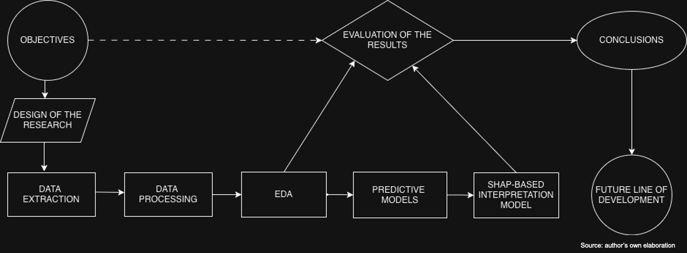
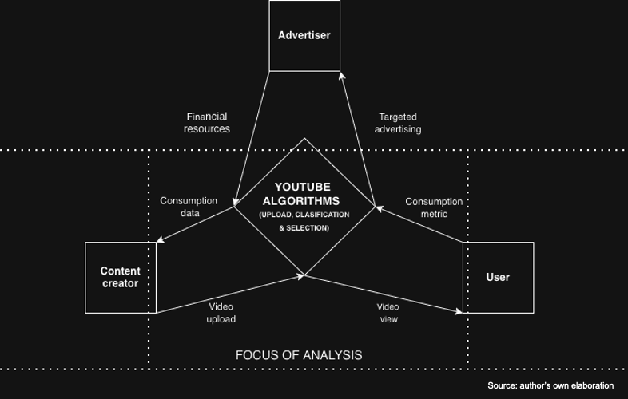
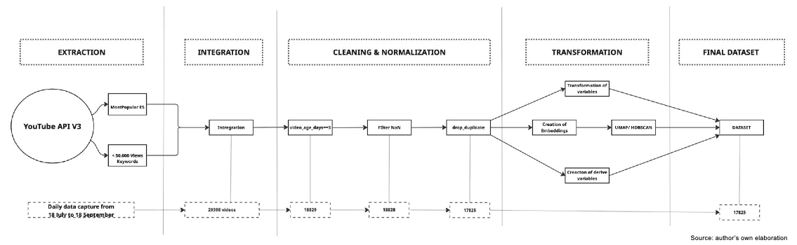
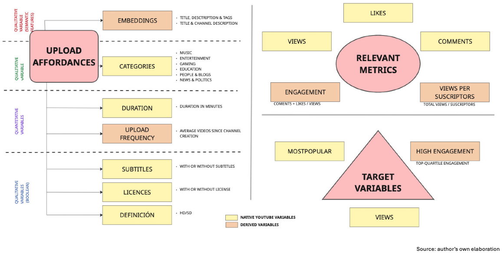

# **TFM – Exploratory and Predictive Analysis of YouTube Upload Affordances (Spain)**  
<!-- Main title summarizing the project -->

This repository contains the code and materials for my Master’s Thesis in Data Analytics.  
The project investigates how YouTube upload affordances (titles, descriptions, tags, categories, duration, etc.) shape **visibility**, **algorithmic selection**, and **engagement**, using both supervised and unsupervised machine learning.

Here is the workflow for the project:


The project is grounded in the idea of YouTube as a platform that structures, filters, and monetizes human activity (van Dijck, Poell & de Waal, 2018). Building on this framework, the analysis examines how YouTube’s selection, ranking, and search algorithms shape the connection between creator-generated content and audiences, as illustrated in the figure below.

<!-- Short introduction already aligned with thesis goals -->

---

## **Project Overview**
<!-- High-level description of what the study does -->

The main goal is to model which semantic and quantitative features influence three core outcomes:

1. **Views** (regression)  
2. **mostPopular** selection (classification)  
3. **High engagement** (top quartile)

The study uses semantic embeddings, clustering, and SHAP interpretability to understand how YouTube’s socio-technical architecture structures visibility and participation.

---

## **Methodology (Brief)**
<!-- Summarized workflow based on your full methods chapter -->

- **Data collection (18 July–18 September)** using YouTube API v3  
  - *mostPopular* (Spain)  
  - videos with <50k views (Spanish keyword seeding)

- **Cleaning and dataset construction**
  - selection of videos on days 3–4 after upload  
  - removal of incorrect captures and duplicates  



- **Semantic embeddings**
  - using *paraphrase-multilingual-MiniLM-L12-v2* (384 dims)  
  - dimensionality reduction with **UMAP** to 5 dims  
  - clustering using **HDBSCAN** (33 clusters)

- **Feature engineering**
  - upload affordances, native metrics, derived ratios  
  - embeddings incorporated with PCA inside the ML pipeline  


- **ML workflow**
  - grouped 80/20 train–test split by channel  
  - grouped 5-fold cross-validation  
  - preprocessing: scaling, OneHotEncoder, PCA  

- **Models tested**
  - Logistic Regression, Decision Tree, Random Forest, XGBoost, Neural Network  

- **Interpretability**
  - SHAP summary plots and variable importance

- **Variables used**
  <!-- Integrated summary of variable groups -->

  The project works with three main groups of variables, as shown in the following figure:



  **1. Upload affordances (creator-controlled features):**  
  semantic embeddings (title, description, tags, channel metadata), video category, duration, upload frequency, and boolean attributes such as subtitles, licensed material, and HD format.

  **2. Performance metrics:**  
  views, likes, comments, and derived indicators including  
  - *engagement rate* = (likes + comments) / views  
  - *views per subscriber* = views / channel subscribers

  **3. Target variables:**  
  - **mostPopular** (YouTube promotional category)  
  - **High engagement** (top quartile)  
  - **Views** (continuous regression target)


<!-- This reflects your actual pipeline accurately -->


---

## **Main Findings (Summary)**
<!-- Condensed findings for quick understanding -->

- **Semantic embeddings are the strongest predictors** across all three targets.  
- **Music content** dominates both *views* and *mostPopular* selection.  
- **Niche instructional content** (religion, finance, emotional health) drives high **engagement**.  
- **Optimal duration differs by outcome**:  
  - 2–5 min → *mostPopular*  
  - 3–13 min → views  
  - 10–25 min → engagement  
- **Excessive upload frequency decreases engagement**, suggesting saturation.  
- Clustering reveals **two content ecologies**: mass-audience vs. niche-community formats.  
- SHAP analysis confirms the **dual algorithmic logic** of YouTube.

<!-- This section gives a compact narrative of your results -->

---

## **Technologies Used**
<!-- Standard tech stack -->

- Python (pandas, numpy, scikit-learn, matplotlib, seaborn)  
- YouTube API v3  
- Jupyter Notebooks  
- sentence-transformers  
- UMAP, HDBSCAN  
- SHAP  
- Git/GitHub  

---

## How to use this repository
1. Clone it:  
   ```bash
   git clone https://github.com/danieldavidmunoz/youtube-trending-spain-2025.git
